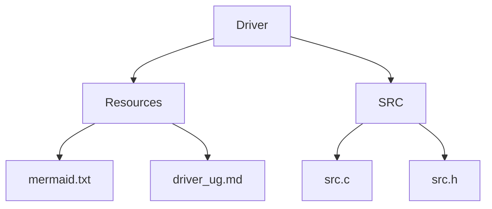

# Testing UML

## .iuml

## Testing Mermaid

* Note: no Doxygen integration documentation
* Not compatibale with Bitbucket, but VS extensions available

```mermaid
graph TD
    A[Driver] --> B[Resources]
    A[Driver] --> C[SRC]
    C --> src.c
    C --> src.h
    B --> mermaid.txt
    B --> driver_ug.md
```
