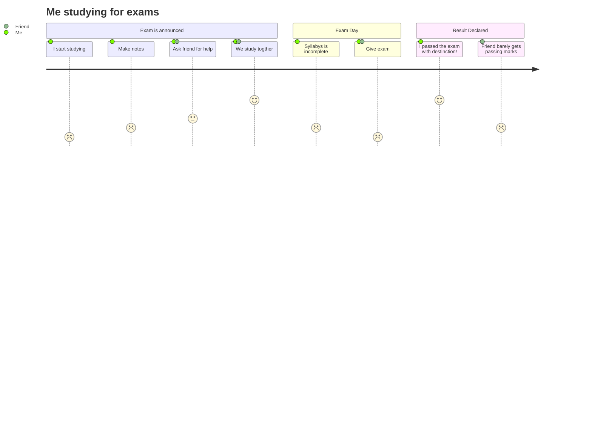

# Testing UML

## Testing Mermaid

```mermaid
journey
	title Me studying for exams
	section Exam is announced
        I start studying: 1: Me
        Make notes: 2: Me
        Ask friend for help: 3: Me, Friend
        We study togther: 5: Me, Friend
    section Exam Day
        Syllabys is incomplete: 2: Me
        Give exam: 1: Me, Friend
    section Result Declared
        I passed the exam with destinction!: 5: Me
        Friend barely gets passing marks: 2: Friend
```
